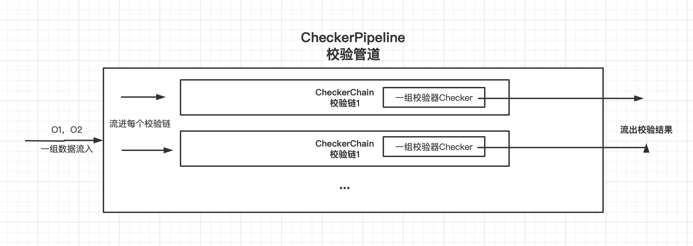

# 对账的核心架构

## 架构图


## 优化

- reconService中Pipeline复用
- Pipeline中提供的线程池的shutdown方法

## 用法

```
        ReconService reconService = new ReconService();
        List<ReconData> o1 = Arrays.asList(new MyReconData().no("1").amount("1.0").source("微信"),
                new MyReconData().no("2").amount("2").source("微信"),
                new MyReconData().no("3").amount("13").source("微信"));

        List<ReconData> o2 = Arrays.asList(new MyReconData().no("1").amount("1.0").source("HIS"),
                new MyReconData().no("2").amount("20").source("HIS"),
                new MyReconData().no("4").amount("13").source("HIS"));
        List<ReconResult> results = reconService.check(new ArrayList<>(o1), new ArrayList<>(o2));
        System.out.println(results);
        
```